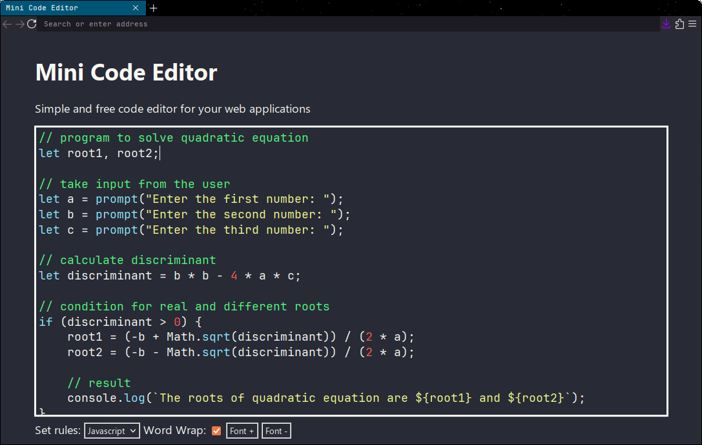

# Mini Code Editor
### Simple and free code editor for your web applications

<div align="center">
	
</div>

<a href="https://adrbog.github.io/MiniCodeEditor/" target="_blank">Demo</a>

## Table of contents
- [About Mini Code Editor](#about-mini-code-editor)
- [Supported languages](#supported-languages)
- [Setup](#setup)
- [Code fast with snippets](#code-fast-with-snippets)
- [Theming](#theming)
- [Support this project](#support-this-project)
- [License](#license)

## About Mini Code Editor
My goal is to create a code editor that is easy to import, easy to configure and has a license that is copyleft (WHY IS EVERYTHING MIT????).<br>
Works on (Tested on): Firefox, Chrome, Badwolf and Pale Moon.

## Supported languages
- C
- CSS
- HTML (consequently XML)
- Javascript
- Python
- Shell
- SQLite

More coming soon...

## Setup

```html
<div id='editor'></div>

<!-- Import the editor -->
<script src='src/editor.js'></script>

<!-- Import the language -->
<script src='languages/html.js'></script>


<script>
	const EDITOR = new MiniCodeEditor('#editor')
	EDITOR.setRules(HTML_RULES)
	// Some configuration (optional)
	EDITOR.setWordWrap(false)
	EDITOR.setReadOnly(false)
	EDITOR.setFontSize(24)
	// Set editor text
	EDITOR.setValue('Hello world')
	// Get editor text
	console.log(EDITOR.getValue())
</script>
```

## Code fast with snippets

Write the keyword and then press <kbd>Ctrl</kbd> + <kbd>Space</kbd> to instantly generate the code block.


Press <kbd>F1</kbd> inside the code editor to view a list of current snippets


## Theming
Mini Code Editor color theme is edited using CSS:

Here is an example of a dark theme
```css
body[theme="dracula"] {
    --mce-color-blue: #8be9fd;
    --mce-color-red: #ff5555;
    --mce-color-green: #50fa7b;
    --mce-color-orange: #ffb86c;
    --mce-color-purple: #bd93f9;
    --mce-color-brown: #f1fa8c;
    --mce-color-black: #282a36;
    --mce-color-white: #f8f8f2;
    --mce-color-bg: #282a36;
    --mce-color-fg: #f8f8f2;
    --mce-color-caret: #f8f8f2;
    --mce-color-select: rgba(153, 153, 255, 0.5);
    --mce-editor-font: 'Jetbrains Mono', monospace;
    --mce-editor-line-height: 1.32;
    --mce-editor-border: 2px groove #f8f8f2;
    --mce-editor-border-focus:  #f8f8f2 0px 1px 4px, #f8f8f2 0px 0px 0px 3px;
}
```

## Support this Project

In this world there are a lot of programming languages, and I can't configure Mini Code Editor for each of them.

If you are interested in contributing to the project, read **CONTRIBUTING.md** to see how to create or edit programming languages in Mini Code Editor.

Alternatively, you can donate

[](https://ko-fi.com/adrbog)

## License

Mini Code Editor<br>
Copyleft (Ↄ) 2024 Adrian Bogdan. All wrongs reserved.<br>
License: [GPL v3.0](https://raw.githubusercontent.com/AdrBog/MiniCodeEditor/main/COPYING)
