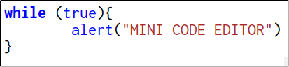
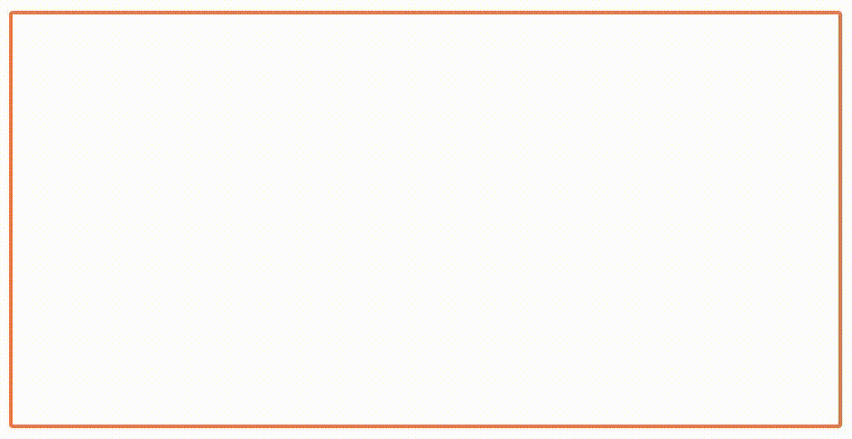

<div align="center">
	
</div>

# Mini Code Editor
### Simple and free code editor for your web applications

<a href="https://adrbog.github.io/MiniCodeEditor/" target="_blank">Demo</a>

## Table of contents
- [About Mini Code Editor](#about-mini-code-editor)
- [Supported languages](#supported-languages)
- [Setup](#setup)
- [Code fast](#code-fast)
- [Theming](#theming)
- [Support this project](#support-this-project)
- [License](#license)

## About Mini Code Editor
My goal is to create a code editor that is easy to import, easy to configure and has a license that is copyleft (WHY IS EVERYTHING MIT????).<br>
Works on (Tested on): Firefox, Chrome, Badwolf and Pale Moon.

## Supported languages
- CSS
- HTML (consequently XML)
- Javascript
- Python
- SQLite

More coming soon...

## Setup

```html
<div id='editor'></div>

<!-- Import the editor -->
<script src='src/editor.js'></script>

<!-- Import the language -->
<script src='languages/html.js'></script>


<script>
	const EDITOR = new MiniCodeEditor('#editor')
	EDITOR.setRules(HTML_RULES)
	// Some configuration (optional)
	EDITOR.setWordWrap(false)
	EDITOR.setReadOnly(false)
	// Set editor text
	EDITOR.setValue('Hello world')
	// Get editor text
	console.log(EDITOR.getValue())
</script>
```

## Code fast

Write the keyword and then press <kbd>Ctrl</kbd> + <kbd>Space</kbd> to instantly generate the code block.


Press <kbd>F1</kbd> inside the code editor to view a list of current keywords




## Theming
Mini Code Editor color theme is edited using CSS:

Here is an example of a dark theme
```css
.mini-code-editor{
    width: 100% !important;
    height: 300px !important;
    background-color: black !important;
    color: white !important;
}
.mini-code-editor-text{
    font-size: 24px !important;
    caret-color: white !important;
}

.mini-code-editor-blue{color: cornflowerblue !important;}
.mini-code-editor-red{color: red !important;}
.mini-code-editor-green{color: greenyellow !important;}
.mini-code-editor-orange{color: orange !important;}
.mini-code-editor-purple{color: darkorchid !important;}
.mini-code-editor-brown{color: chocolate !important;}
.mini-code-editor-black{color: white !important;}

.mini-code-editor-blue-imp, .mini-code-editor-blue-imp *{color: cornflowerblue !important;}
.mini-code-editor-red-imp, .mini-code-editor-red-imp *{color: red !important;}
.mini-code-editor-green-imp, .mini-code-editor-green-imp *{color: greenyellow !important;}
.mini-code-editor-orange-imp, .mini-code-editor-orange-imp *{color: orange !important;}
.mini-code-editor-purple-imp, .mini-code-editor-purple-imp *{color: darkorchid !important;}
.mini-code-editor-brown-imp, .mini-code-editor-brown-imp *{color: chocolate !important;}
.mini-code-editor-black-imp, .mini-code-editor-black-imp *{color: white !important;}
```

## Support this Project

In this world there are a lot of programming languages, and I can't configure Mini Code Editor for each of them.

If you are interested in contributing to the project, read **CONTRIBUTING.md** to see how to create or edit programming languages in Mini Code Editor.

Alternatively, you can donate

[](https://ko-fi.com/adrbog)

## License

Mini Code Editor<br>
Copyleft (Ↄ) 2024 Adrian Bogdan. All wrongs reserved.<br>
License: [GPL v3.0](https://raw.githubusercontent.com/AdrBog/MiniCodeEditor/main/COPYING)
